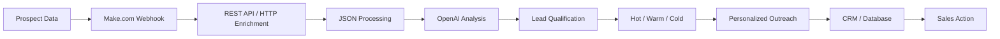

# AI-Powered-B2B-Sales-Prospecting-Outreach-Automation-Make.com-APIs

**Executive Summary**: Modern B2B sales demand end-to-end automation. This Make.com project builds a **real-world sales pipeline** that takes raw leads through every step—**capture → enrichment → AI analysis → qualification → personalization → CRM sync → action**—with no code needed. It leverages Make.com’s visual workflows, webhooks, REST APIs, and OpenAI GPT-4 to automate prospecting. For example, a similar “Lead Scoring & Notification Bot” captures leads in real time, scores them, enriches with AI, and alerts only on high-value opportunities. By automating each step, sales teams focus on the best leads and send tailored messages at scale. Industry data backs this: 80% of AI-savvy sales teams report measurable revenue growth, often reclaiming 4–7 hours per rep per week. Many organizations see **3× more qualified meetings and ~21 hours/week saved per rep with AI-driven workflows.**

## How It Works

This project turns raw prospect data into **qualified B2B sales opportunities and personalized outreach** through a practical Make.com automation workflow.

### 1. Capture Prospect Data
A **Make.com Custom Webhook** receives new prospect information from an external source and starts the workflow instantly.

### 2. Enrich the Lead
The workflow uses **HTTP requests and REST APIs** to collect additional company and prospect information. JSON data is structured and prepared for the next stage.

### 3. Analyze with AI
The enriched profile is passed to **OpenAI** for AI-powered analysis. The workflow evaluates company context, potential needs, relevance, and available sales signals.

### 4. Qualify & Score
The automation combines AI analysis with defined qualification criteria to determine lead quality.

Leads can then be classified into:

- 🔥 **Hot** — strong potential and high priority
- 🟡 **Warm** — relevant opportunity requiring further qualification
- ⚪ **Cold** — lower current priority

### 5. Create Personalized Outreach
For qualified prospects, AI generates a **context-aware LinkedIn outreach message** based on the available prospect information instead of using one generic message for everyone.

### 6. Update the CRM / Database
The workflow stores the enrichment data, qualification result, lead score, and outreach draft in the connected **CRM or database**, keeping sales information organized and actionable.

### 7. Trigger the Next Sales Action
Only qualified opportunities move forward. The workflow can notify a sales representative, prepare the next outreach step, or trigger another connected automation.

**The result:** a connected sales pipeline that moves from  
**Prospect → Enrichment → AI Analysis → Lead Scoring → Personalization → CRM → Sales Action.**

---

## Real Workflow Proof

### AI Prospecting & Lead Scoring

*Live workflow showing prospect processing, AI analysis, lead scoring, and sales prioritization.*

### AI Lead Qualification & Personalized Outreach

*Live automation showing lead qualification, AI-generated personalization, outreach preparation, and CRM workflow.*

---

## Two Connected Sales Workflows

| Workflow | Purpose | AI Output | Business Value |
|---|---|---|---|
| **AI Lead Scoring** | Qualify and prioritize prospects | Hot / Warm / Cold classification | Helps sales teams focus on stronger opportunities |
| **AI Outreach** | Personalize qualified leads | Context-aware outreach draft | Reduces repetitive manual writing |

---

## Automation Architecture

## 🛠️ Tech Stack

**Make.com** · **OpenAI** · **REST APIs** · **HTTP** · **Webhooks** · **JSON**  
**CRM Automation** · **AI Lead Scoring** · **B2B Sales Prospecting** · **Personalized Outreach**

**Automation flow:**  
`Make.com → Webhooks → APIs → JSON → OpenAI → Lead Scoring → CRM → Outreach`

Make.com supports custom webhooks for receiving data from external services, while its HTTP and JSON tools support API requests and structured data processing. This project applies those capabilities to a practical B2B sales workflow. :contentReference[oaicite:1]{index=1}

## 🚀 What This Project Demonstrates

| Capability | What I Built |
|---|---|
| 🤖 **AI Lead Qualification** | Analyze prospect and company context with AI |
| 🔎 **Data Enrichment** | Collect and structure additional prospect information |
| 🎯 **Lead Scoring** | Prioritize leads using defined qualification signals |
| 🔥 **Hot / Warm / Cold** | Classify prospects by sales priority |
| 🔗 **API Integration** | Connect external services through REST/HTTP |
| ⚡ **Webhook Automation** | Trigger workflows when new prospect data arrives |
| 📦 **JSON Processing** | Structure and transform workflow data |
| 🧩 **CRM Automation** | Store qualification and prospect information |
| 💬 **Personalized Outreach** | Generate relevant outreach drafts for qualified leads |
| ⚙️ **Make.com Workflows** | Connect the complete process into one automation |

## 👨‍💻 Built by Zerihun A

I built this project to demonstrate how **AI + APIs + workflow automation** can turn a manual B2B prospecting process into a structured and repeatable sales workflow.

The focus is practical: **capture the right data, understand the prospect, qualify the opportunity, personalize the next step, and keep the sales workflow organized.**

### 🤝 Open to Projects & Hiring

Looking for a **Make.com Automation Specialist, AI Automation Builder, CRM Automation Specialist, or B2B Sales Automation Developer?**

**Let's turn your repetitive sales process into a practical automation that saves time and helps your team focus on the right opportunities.**
